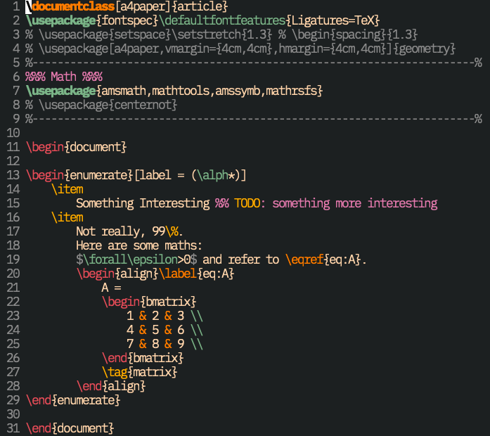
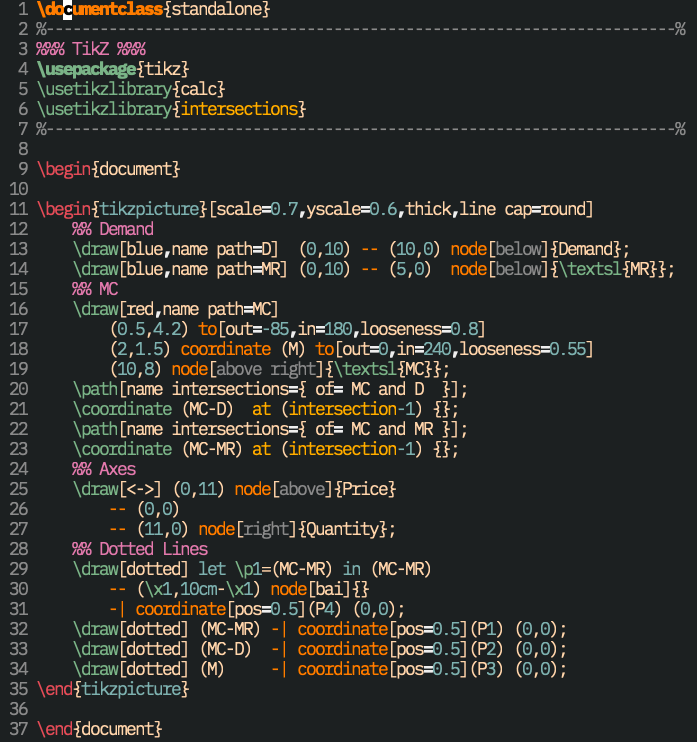
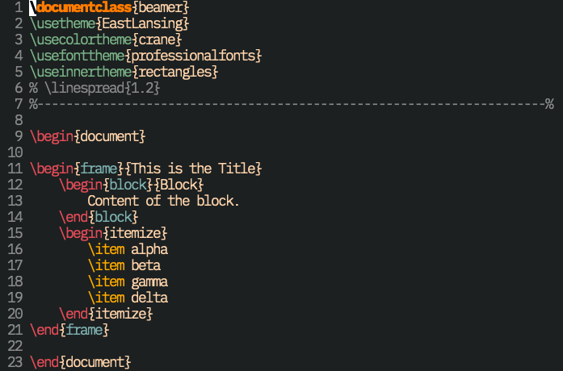
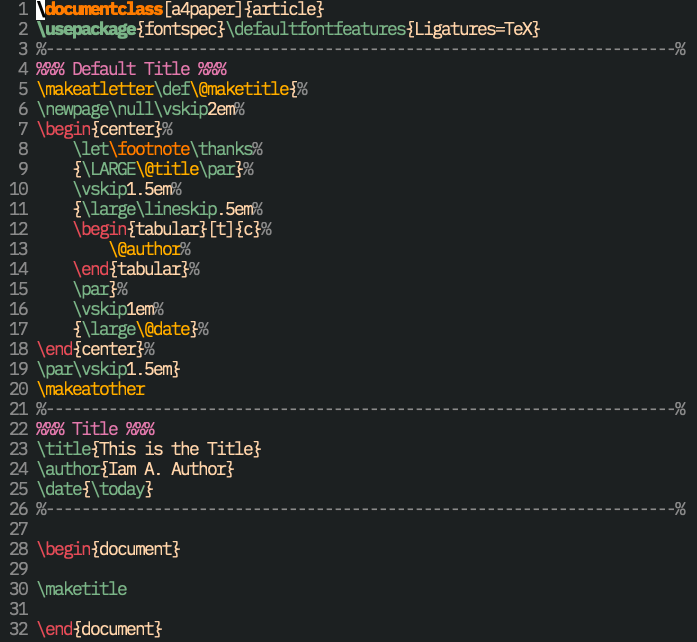

# vim-bunttex

LaTeX syntax highlight in Vim/Nvim are way too complicated (causing Vim to be extremely slow on large TeX files) and unnecessarily colourful.
Thus, I created my own LaTeX syntax highlight file with the aim of being simple and readable.
See what it looks like in the [Showcase](#showcase) section.

Two features of my LaTeX syntax files:

- **minimalism**:
  LaTeX files can be *huge*.
  I don't need complex regex rules to highlight every detail.
  The [main syntax file](syntax/tex.vim) contains less than 50 lines (excluding comments).
  It only highlights what I consider to be necessary.
- **supporting files**:
  Sometimes you need extra highlightings, e.g., when writing beamer or Ti*k*Z.
  I also provide additional syntax files you can [use](#tips) in specific circumstances:
	- [`tikz.vim`](syntax-additional/tikz.vim): For Ti*k*Z syntax. (see a [showcase](#tikz))
	- [`beamer.vim`](syntax-additional/beamer.vim): For beamer, highlighting `frame` and `block` environments. (see a [showcase](#beamer))
	- [`figure.vim`](syntax-additional/figure.vim): For highlighting `figure` and `table` environments.
	- [`mathnotes.vim`](syntax-additional/mathnotes.vim): For highlighting environments such as `definition`, `theroem`, `proof`, etc.
	- [`plain_tex.vim`](syntax-additional/plain_tex.vim): For highlighting plain TeX command, e.g., `\@maketitle`.
	- [`document.vim`](syntax-additional/document.vim): For highlighting `\begin{document}` and `\end{document}`.
	- [`acronym.vim`](syntax-additional/acronym.vim): For not spellchecking acronyms in `\acrlong{}` or `\acrshort{}`.

## Installation

Install using your favourite plugin manager, or use Vim's built-in package
support:
```sh
mkdir -p ~/.vim/pack/jessekelighine/start
cd ~/.vim/pack/jessekelighine/start
git clone https://github.com/jessekelighine/vim-bunttex
```

**However**, I urge you to simply put the file [`tex.vim`](syntax/tex.vim) in directory `~/.vim/syntax/` (or `~/.config/nvim/syntax/` for Neovim)
and only download the supporting files you need for two reasons:

1. It's less than 50 lines of code.
2. You would probably customize it a lot. (Make it your own!)
3. You don't need all the supporting files, only download the ones you need.

See [Tips](#tips) section to learn a how to use the supporting files.

## Tips

Source the support files only when you need them.
For example, when you open a Ti*k*Z file (e.g., [`tikz.tex`](demo/tikz.tex)),
simply run
```vim
:source path/to/tikz.vim
```
and you will get highlighting for Ti*k*Z (something that looks like [this](#tikz)).
To 'undo' the Ti*k*Z highlighting, run
```vim
:set ft=tex
```
and the Ti*k*Z highlighting will be reverted.

To avoid typing and memorizing `path/to/tikz.vim`,
you can put this in your `~/.vim/ftplugin/tex.vim` (or `~/.config/nvim/ftplugin/tex.vim` for Neovim):
```vim
command! -buffer -nargs=0 HighlightTikz :source path/to/tikz.vim
```
Now you can use `:HighlightTikz` whenever you need Ti*k*Z highlighting!

## Showcase

All showcased code can be found in the directory [`demo`](demo).
The colorscheme is [Miramare](https://github.com/franbach/miramare) and
the font is [IBM Plex Mono](https://www.ibm.com/plex/).

### Basic LaTeX

This is what you'll get with only the 50 lines of code from [`tex.vim`](syntax/tex.vim):



### Ti*k*Z

This is what you'll get from sourcing [`tikz.vim`](syntax-additional/tikz.vim):



### Beamer

This is what you'll get from sourcing [`beamer.vim`](syntax-additional/beamer.vim)
(now `frame` and `block` environments are in blue):



### Plain TeX

This is what you'll get from sourcing [`plain_tex.vim`](syntax-additional/plain_tex.vim)
(now commands like `\@maketitle` is colored in yellow):



## License

Distributed under the same terms as Vim itself. See `:help license`.
